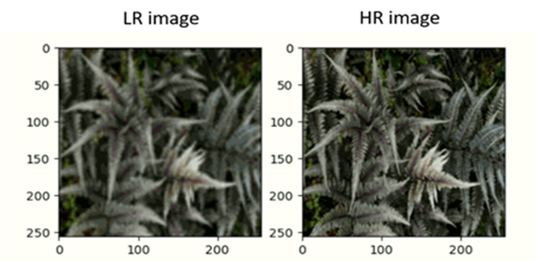
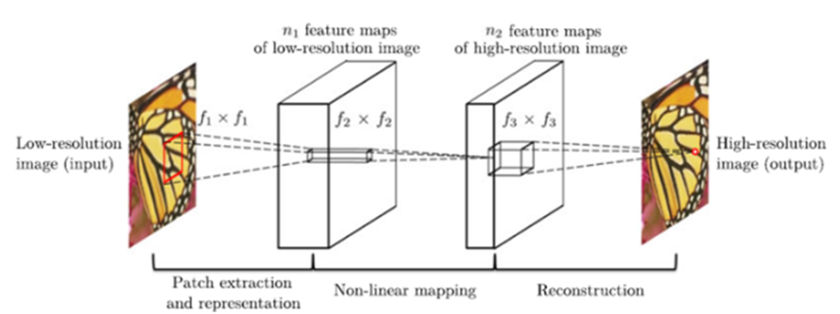

Image Super Resolution using ResUnet [keras]
-------------------------------------------------------

# 1. Used data
  본 프로젝트는 Kaggle dataset에 있는 [Super Image Resolution](https://www.kaggle.com/akhileshdkapse/super-image-resolution)으로 부터 데이터를 이용하여 진행함.
  
  정답 데이터 100장, 입력 데이터 100장으로 전처리를 진행 한 뒤, 이미지의 크기는 256 x 256으로 조정함.

# 2. Models

## 2.1 SR CNN

SR CNN은 2016년도 딥러닝에 Super Resolution(SR) 기술이 적용될 때 처음 적용된 모델임.

파라미터는 총 20,099개이며, 3개의 convolutional layer로 이루어져 있는 단순하며 강력한 모델임.

## 2.2 Deep Denoise SR CNN

Deep Denoise SR CNN은 AutoEncoder에 의미있는 특성을 학습하도록 입력에 노이즈를 추가하여, 노이즈가 없는 원본 입력을 재구성하도록 학습시키는 Denoising AutoEncoder을 이용한다. 추가로, Unet의 특징인 Skip Connection을 추가하여 이미지를 좀 더 선명하게 복원하도록 해주는 모델임.

파라미터는 총 1,113,475개가 사용됨.

## 2.3 Our model [ResUnet]

ResUnet의 베이스는 총 4번의 다운샘플링과(DownSampling), 업샘플링(Upsampling)을 진행한 Unet을 이용하고 추가적으로 잔차 유닛(Residual unit)을 이용한 모델임.

잔차 유닛은 각 합성곱 레이어의 입력 값을 출력 값에 더해주는 지름길 연결을 이용하여, 그래디언트 소실 현상을 방지할 뿐 만 아니라 학습의 속도를 가속화 시킬 수 있음.

구현한 ResUnet의 파라미터는 총 5,216,435개가 사용됨.

